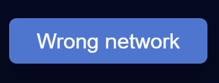

# FAQ

### Can I withdraw?

Even though it is not possible to withdraw your initial investment immediately, the community can create a proposal to liquidate one of our investments, e.g. selling a NFT, then that capital would be distributed.

### What is the approval process?

A smart contract requires approval from the wallet owner before it can remove funds from the wallet and deposit into the contract or transfer to another wallet. This can be detrimental if you aren't paying attention.

Suppose you visit a store or make an online purchase with a credit card. By signing or agreeing to the amount plus taxes, you authorize the purchase for that exact amount you see on the screen. In a smart contract, this is what happens, but it is possible to approve an amount greater than your purchase.

Here's another example. Suppose you want to approve only 10 USDC, but the contract approves 1000 USDC. Since you have already approved the transaction, the remaining 990 can be taken at any time.

The best practice in DeFi is to double-check the amount. In MetaMask click the "Edit Permission" link.

Just as with credit card purchases, you can check if the amount is accurate here.

.png>)
