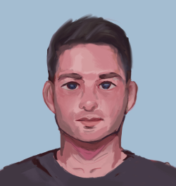

# Meet the Team!

## Erik

👋 CEO / Founder— 💌 [Erik](https://t.me/athamefinance)

### Bio

I have thirty years of professional technology experience.  I started out on the infrastructure side then moved to development.  My last position I was a Chief Technology Officer but left to pursue Athame Finance.  I got my start in crypto mining Bitcoin when it was still possible to mine with CPU, then moved to GPU.  I have been investing in various DeFi and Dapps for several years now.

## Heather

👋 COO / Co-Founder— 💌 [Heather](https://t.me/athamefinance)

### Bio

I have twenty years of experience as a project/program manager at various companies.  I've also worked as a VP of QA.  I've been investing in crypto defi since 2017.
